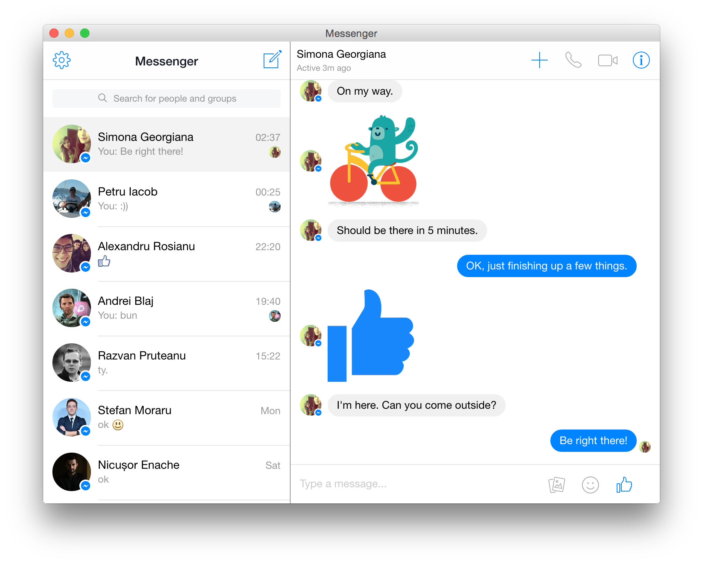

# Messenger for Desktop

Bring [messenger.com](https://messenger.com) to your OS X, Windows or Linux desktop. Built with [NW.js](http://nwjs.io/). Not affiliated with Facebook.

## Features

* Sounds *(can be disabled in settings)*
* Desktop notifications *(enable them in settings)*
* Voice and video calls

## Extra

* Badge with the number of notifications in the dock/taskbar (OS X and Windows)
* Auto-launch on OS startup (OS X, Windows)
* Native notifications (all platforms)
* System tray icon on Windows
* 3 themes: Default, Dark and Mosaic
* Auto-hide the left sidebar
* Open links in browser or new window
* Preferences in the right-click context menu (or menu bar for OS X, tray menu for Windows)

## Build

### Pre-requisites

    # install gulp
    npm install -g gulp

    # install dependencies
    npm install

* **wine**: If you're on OS X/Linux and want to build for Windows, you need [Wine](http://winehq.org/) installed. Wine is required in order
to set the correct icon for the exe. If you don't have Wine, you can comment out the `winIco` field in `gulpfile`.
* **makensis**: Required by the `pack:win32` task in `gulpfile` to create the Windows installer.
* [**fpm**](https://github.com/jordansissel/fpm): Required by the `pack:linux{32|64}:deb` tasks in `gulpfile` to create the linux installers.

Quick install on OS X:

    brew install wine makensis
    sudo gem install fpm

### OS X: pack the app in a .dmg

    gulp pack:osx64

### Windows: create the installer

    gulp pack:win32

### Linux 32/64-bit: pack the app in a .deb

    gulp pack:linux{32|64}:deb

The output is in `./dist`. Take a look in `gulpfile.coffee` for additional tasks.

**TIP**: use the `--toolbar` parameter to quickly build the app with the toolbar on. E.g. `gulp build:win32 --toolbar`.

**TIP**: use `gulp build:win32 --noicon` to quickly build the Windows app without the icon.

**TIP**: for OS X, use the `run:osx64` task to build the app and run it immediately.

## Contributions

Contributions are welcome! For feature requests and bug reports please [submit an issue](https://github.com/Aluxian/Facebook-Messenger-Desktop/issues).

## License

The MIT License (MIT)

Copyright (c) 2015 Alexandru Rosianu

Permission is hereby granted, free of charge, to any person obtaining a copy
of this software and associated documentation files (the "Software"), to deal
in the Software without restriction, including without limitation the rights
to use, copy, modify, merge, publish, distribute, sublicense, and/or sell
copies of the Software, and to permit persons to whom the Software is
furnished to do so, subject to the following conditions:

The above copyright notice and this permission notice shall be included in all
copies or substantial portions of the Software.

THE SOFTWARE IS PROVIDED "AS IS", WITHOUT WARRANTY OF ANY KIND, EXPRESS OR
IMPLIED, INCLUDING BUT NOT LIMITED TO THE WARRANTIES OF MERCHANTABILITY,
FITNESS FOR A PARTICULAR PURPOSE AND NONINFRINGEMENT. IN NO EVENT SHALL THE
AUTHORS OR COPYRIGHT HOLDERS BE LIABLE FOR ANY CLAIM, DAMAGES OR OTHER
LIABILITY, WHETHER IN AN ACTION OF CONTRACT, TORT OR OTHERWISE, ARISING FROM,
OUT OF OR IN CONNECTION WITH THE SOFTWARE OR THE USE OR OTHER DEALINGS IN THE
SOFTWARE.
