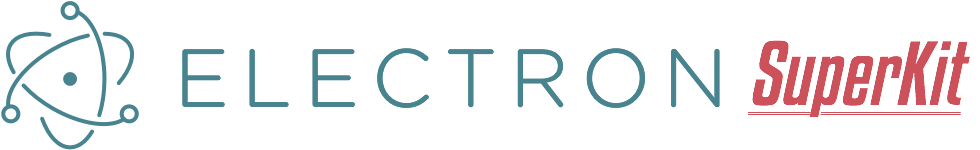
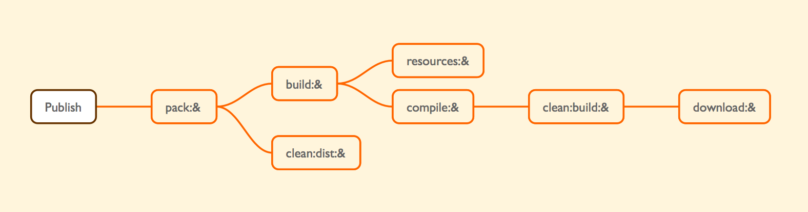

:zap: *An Electron starter kit with super powers.* :zap:

[Electron](http://electron.atom.io/) lets you write cross-platform desktop applications using JavaScript, HTML and CSS. It is based on io.js and Chromium and is used in the [Atom](https://atom.io/) editor.

Electron SuperKit uses [Gulp](http://gulpjs.com/) to build, sign, pack and publish your awesome apps. All the Electron goodies are included:

- automatic updates (OS X, Windows)
- crash reporting
- windows installer
- debugging & profiling
- native menus & notifications

:fire: Extra:

- dmg installer for OS X
- deb & rpm packages for Linux
- write ES6 JavaScript, ship ES5 code
- write LESS stylesheets, ship CSS code
- automatically publish releases to GitHub
- use [AppVeyor](http://www.appveyor.com/) to build Windows releases (no need for a Windows machine)
- live reload in development

> **Note**: The kit is not finished. I'm still working on polishing some features and making some others work. Why not join me? :)

## Install pre-requisites

Let's get started! You need the following:

* [**node & npm**](https://nodejs.org/): I recommend the latest versions.
* [**fpm**](https://github.com/jordansissel/fpm): Required to create deb and rpm packages.

Quickly install all this stuff on OS X:

    $ sudo gem install fpm
    $ brew install node rpm

## Install dependencies

:white_check_mark: Global dependencies:

    $ npm install -g gulp

:white_check_mark: Local dependencies:

    $ npm install

The last command should also install the modules for `./src`. If `./src/node_modules/` doesn't exist then:

    $ cd ./src
    $ npm install

## Build

You'll be doing most of your magic work inside the `src` folder.

    $ gulp build:darwin64
    $ gulp build:linux32
    $ gulp build:linux64
    $ gulp build:win32

You'll find all your neat stuff inside the `./build` folder. You can also use the watch tasks to make development easier:

    $ gulp watch:darwin64
    $ gulp watch:linux32
    $ gulp watch:linux64
    $ gulp watch:win32

As you edit files in `./src`, they will be re-compiled and moved into the `build` folder.

## Pack

Package *all* the things!

### OS X

Pack the app in a neat .dmg:

    $ gulp pack:darwin64

This uses [node-appdmg](https://www.npmjs.com/package/appdmg) which works only on OS X machines. There's an issue about making it cross-platform [here](https://github.com/LinusU/node-appdmg/issues/14).

### Windows

Create an installer. This will also sign every executable inside the app, and the setup exe itself:

    $ gulp pack:win32:installer

Or, if you prefer, create a portable zip. This will also sign the executable:

    $ gulp pack:win32:portable

These tasks only work on Windows machines due to their dependencies: [Squirrel.Windows](https://github.com/Squirrel/Squirrel.Windows) and Microsoft's SignTool.

If you don't have a Windows machine at hand, you can use AppVeyor. When you push a tagged commit in a branch named `deploy`, AppVeyor will automatically start the build and create a new GitHub release based on the appveyor.yml config file. You'll have to replace some secret keys in the config with your own to make it work.

### Linux

Create deb packages:

    $ gulp pack:linux32:deb
    $ gulp pack:linux64:deb

Create rpm packages:

    $ gulp pack:linux32:rpm
    $ gulp pack:linux64:rpm

Make sure you've installed [fpm](https://github.com/jordansissel/fpm).

## How it works

### Project structure

| Path                            | Description
| ------------------------------- | -----------
| build/                          | The Electron framework, the compiled source code and the processed resources are moved here during build.
| dist/                           | Here you'll find the installers/packages.
| cache/                          | Downloaded zip files of Electron releases are placed here.
| docs/                           | Exactly. I also recommend reading [Electron's documentation](https://github.com/atom/electron/tree/master/docs#readme).
| resources/                      | Icons and config files used to create the installers/packages.
| src/                            | The sweet things. HTML pages, scripts, stylesheets, modules and everything your app needs.
| tasks/                          | Finely written Gulp tasks to aid you in your super-businesses.
| .babelrc                        | Config file for the Babel transpiler.
| .env-example                    | You should have these variables in your environment for various tasks.
| .eslintignore, .eslintrc        | Useful if you use the [linter-eslint](https://atom.io/packages/linter-eslint) plugin for Atom.
| .gitignore                      | C'mon, you're familiar with this stuff.
| appveyor.yml                    | This file is used by AppVeyor to know how to build the Windows releases.
| CHANGELOG.md                    | Write here your changes after each release. If you want to, of course.
| design.sketch                   | The assets I designed for SuperKit. You can use it as a template to create your own.
| gulpfile.coffee                 | Just an entry point to tell Gulp where to find our tasks.
| LICENSE.md                      | Yep.
| package.json                    | Dependencies and stuff. Replace the names and urls with your own.
| README.md                       | This mighty file.

Don't forget to set the vars listed in `.env-example`. You'll need them for some of the tasks.

### Gulp tasks

| Name                            | Description
| ------------------------------- | -----------
| build:&                         | Used to move assets and edit properties of some files, depending on the platform.
| clean:build:&                   | Clean the build folder (remove the default app that ships with Electron).
| clean:dist:&                    | Remove files in dist and make sure the directory exists.
| compile:&                       | Compile, process and move your code into the build folder.
| download:&                      | Download the Electron framework. Cache the files, then unzip them and move them into the build folder.
| pack:&                          | Create the installers/packages. These also handle app signing.
| publish:github                  | Upload the dist files to GitHub.
| purge:{build,cache,dist}        | Abolish the chosen directory.
| resources:{darwin,linux,win}    | Process the resources and move them to the build folder.
| watch:&                         | Compile and move the source files into the build directory every time they change. This uses livereload.

Here's how the dependency tree looks like:

The `&` symbol is a placeholder for `{darwin64,linux32,linux64,win32}`.

### Code signing

For development/internal use, creating installers without a signature is okay, but for a production app you need to sign your application. Internet Explorer's SmartScreen filter will block your app from being downloaded, and many anti-virus vendors will consider your app as malware unless you obtain a valid cert.

Any certificate valid for "Authenticode Code Signing" will work, but if you get the right kind of code certificate, you can also opt-in to Windows Error Reporting.

If you don't have a certificate, read my blog post about how to get one: [Free code signing certificate for Open-Source Software](http://blog.aluxian.com/free-code-signing-certificate-for-open-source-software/).

## Publish

Ready for prime time? Upload your super app to GitHub:

    $ gulp publish:github

This will create a new GitHub release with all the files inside the `dist` folder.

## Contributions

Contributions are welcome! For feature requests and bug reports please [submit an issue](https://github.com/Aluxian/electron-superkit/issues).

## License

The MIT License (MIT)

Copyright (c) 2015 Alexandru Rosianu

Permission is hereby granted, free of charge, to any person obtaining a copy
of this software and associated documentation files (the "Software"), to deal
in the Software without restriction, including without limitation the rights
to use, copy, modify, merge, publish, distribute, sublicense, and/or sell
copies of the Software, and to permit persons to whom the Software is
furnished to do so, subject to the following conditions:

The above copyright notice and this permission notice shall be included in all
copies or substantial portions of the Software.

THE SOFTWARE IS PROVIDED "AS IS", WITHOUT WARRANTY OF ANY KIND, EXPRESS OR
IMPLIED, INCLUDING BUT NOT LIMITED TO THE WARRANTIES OF MERCHANTABILITY,
FITNESS FOR A PARTICULAR PURPOSE AND NONINFRINGEMENT. IN NO EVENT SHALL THE
AUTHORS OR COPYRIGHT HOLDERS BE LIABLE FOR ANY CLAIM, DAMAGES OR OTHER
LIABILITY, WHETHER IN AN ACTION OF CONTRACT, TORT OR OTHERWISE, ARISING FROM,
OUT OF OR IN CONNECTION WITH THE SOFTWARE OR THE USE OR OTHER DEALINGS IN THE
SOFTWARE.
